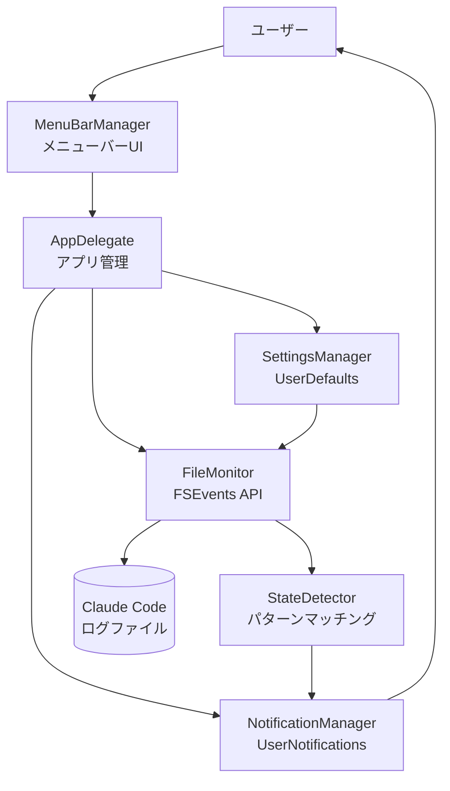

# claude-code-notifier アーキテクチャ設計

**作成日**: 2026-03-26
**関連要件定義**: [requirements.md](../../spec/claude-code-notifier/requirements.md)
**ヒアリング記録**: [design-interview.md](design-interview.md)

**【信頼性レベル凡例】**:
- 🔵 **青信号**: EARS要件定義書・設計文書・ユーザヒアリングを参考にした確実な設計
- 🟡 **黄信号**: EARS要件定義書・設計文書・ユーザヒアリングから妥当な推測による設計
- 🔴 **赤信号**: EARS要件定義書・設計文書・ユーザヒアリングにない推測による設計

---

## システム概要 🔵

**信頼性**: 🔵 *要件定義書より*

macOSメニューバー常駐アプリで、複数のClaude Codeタスクを監視し、回答待ち・指示待ち・タスク完了の状態を検出してユーザーに通知するシステム。Claude Codeの複数タスク並行実行時に、タスクが待機状態になっていることに気づけない問題を解決します。

## アーキテクチャパターン 🔵

**信頼性**: 🔵 *REQ-006・設計ヒアリングより*

- **パターン**: メニューバー常駐型アプリケーション（Status Bar App）
- **選択理由**:
  - macOSのメニューバーに常駐し、バックグラウンドで動作
  - リソース消費を最小限に抑えながら継続的な監視が可能
  - ユーザーの作業を邪魔せず、必要な時に通知を提供

## コンポーネント構成

### アプリケーション層 🔵

**信頼性**: 🔵 *REQ-401・設計ヒアリングより*

- **言語**: Swift
- **フレームワーク**: AppKit（macOSネイティブアプリ）
- **ビルドシステム**: Xcode
- **最小対応バージョン**: macOS 11.0 (Big Sur) 🟡 *一般的な要件から推測*

### コアコンポーネント

#### 1. AppDelegate 🔵

**信頼性**: 🔵 *REQ-006・macOS標準パターンより*

- アプリケーションのライフサイクル管理
- ログイン時自動起動の設定
- 各コンポーネントの初期化と連携

#### 2. FileMonitor 🔵

**信頼性**: 🔵 *REQ-001・設計ヒアリング Q1より*

- **役割**: Claude Codeのログファイルを監視
- **技術**: FSEvents API
- **機能**:
  - ログファイルの変更を検出
  - 新規エントリの読み込み
  - 変更イベントのトリガー

#### 3. StateDetector 🔵

**信頼性**: 🔵 *REQ-002, REQ-003, REQ-004より*

- **役割**: ログエントリから状態を検出
- **機能**:
  - 回答待ち状態のパターンマッチング
  - 指示待ち状態のパターンマッチング
  - タスク完了のパターンマッチング
  - 検出した状態の通知

#### 4. NotificationManager 🔵

**信頼性**: 🔵 *REQ-005・設計ヒアリングより*

- **役割**: macOS通知センターへの通知送信
- **技術**: UserNotifications framework
- **機能**:
  - 通知権限の要求
  - 通知の送信
  - 通知のクリックハンドリング 🟡 *UX向上のため推測*

#### 5. MenuBarManager 🔵

**信頼性**: 🔵 *REQ-006より*

- **役割**: メニューバーUIの管理
- **技術**: NSStatusBar, NSStatusItem
- **機能**:
  - メニューバーアイコンの表示
  - クリック時のメニュー表示
  - 監視状態の表示
  - 設定画面へのアクセス

#### 6. SettingsManager 🔵

**信頼性**: 🔵 *設計ヒアリング Q3より*

- **役割**: 設定情報の保存・読み込み
- **技術**: UserDefaults
- **保存する設定**:
  - ログファイルパス
  - 通知有効/無効
  - 監視対象の状態（回答待ち、指示待ち、タスク完了）

## システム構成図



**信頼性**: 🔵 *要件定義・設計ヒアリングより*

## ディレクトリ構造 🔵

**信頼性**: 🔵 *Swift標準プロジェクト構造より*

```
claude-code-notifier/
├── ClaudeCodeNotifier/
│   ├── App/
│   │   └── AppDelegate.swift
│   ├── Models/
│   │   ├── ClaudeCodeState.swift
│   │   └── NotificationContent.swift
│   ├── Managers/
│   │   ├── FileMonitor.swift
│   │   ├── StateDetector.swift
│   │   ├── NotificationManager.swift
│   │   ├── MenuBarManager.swift
│   │   └── SettingsManager.swift
│   ├── Views/
│   │   └── SettingsView.swift
│   ├── Resources/
│   │   ├── Assets.xcassets/
│   │   └── Info.plist
│   └── Utils/
│       ├── LogParser.swift
│       └── Constants.swift
├── ClaudeCodeNotifierTests/
│   └── (テストファイル)
├── docs/
│   ├── spec/
│   │   └── claude-code-notifier/
│   └── design/
│       └── claude-code-notifier/
└── README.md
```

## 非機能要件の実現方法

### パフォーマンス 🔵

**信頼性**: 🔵 *NFR要件・設計ヒアリングより*

- **目標**: CPU使用率1%未満
- **実現方法**:
  - FSEvents APIによる効率的なファイル監視（ポーリング不要）
  - イベント駆動型アーキテクチャ
  - 非同期処理によるメインスレッドのブロッキング回避
- **通知レスポンスタイム**: 状態変化から1秒以内
  - FSEventsの即時イベント通知
  - パターンマッチングの最適化

### セキュリティ 🔵

**信頼性**: 🔵 *NFR要件より*

- **ファイルアクセス権限**:
  - 初回起動時にログファイルアクセス権限を要求
  - macOSのファイルアクセス権限ダイアログを表示
  - 権限が拒否された場合の適切なエラーメッセージ
- **データ保護**:
  - ログファイルの内容は解析のみ、外部送信なし
  - 設定情報はローカルのUserDefaultsに保存

### ユーザビリティ 🟡

**信頼性**: 🟡 *NFR要件・macOSデザインガイドラインから推測*

- **メニューバーアイコン**:
  - シンプルで小さいアイコン（16x16 / 32x32 @2x）
  - 監視状態に応じたアイコン変化（オプション）
- **通知**:
  - 明確で簡潔なメッセージ
  - アクションボタン（Claude Codeを開く等）
  - 通知の重複抑制（同じ状態の連続通知を防ぐ）

### 可用性 🟡

**信頼性**: 🟡 *一般的な要件から推測*

- **自動起動**: ログイン時自動起動により、常に監視が有効
- **エラーハンドリング**:
  - ログファイルが見つからない場合の警告
  - ファイル読み込みエラーのリトライ
  - 通知送信失敗時のログ記録

## 技術的制約

### パフォーマンス制約 🔵

**信頼性**: 🔵 *NFR要件より*

- CPU使用率1%未満を維持
- メモリ使用量50MB以下 🟡 *軽量アプリの一般的な目標値*
- バッテリー消費への影響を最小限に

### プラットフォーム制約 🔵

**信頼性**: 🔵 *REQ-402より*

- macOS専用（Windows/Linuxは対象外）
- FSEvents APIの使用によりmacOS依存
- 最小対応バージョン: macOS 11.0 (Big Sur) 🟡 *一般的な要件から推測*

### 依存関係制約 🔵

**信頼性**: 🔵 *設計ヒアリング・Swift標準より*

- 外部ライブラリへの依存を最小限に
- macOS標準フレームワークのみ使用:
  - AppKit
  - Foundation
  - UserNotifications
  - CoreServices (FSEvents)

## 起動とライフサイクル 🔵

**信頼性**: 🔵 *設計ヒアリング Q2より*

### 起動フロー

1. **アプリケーション起動**
   - AppDelegate初期化
   - 各Managerの初期化
   - 設定の読み込み（SettingsManager）

2. **ログイン項目設定** 🔵
   - 初回起動時にログイン項目への追加を確認
   - SMLoginItemSetEnabled APIを使用

3. **監視開始**
   - FileMonitorの開始
   - ログファイルパスの取得（設定または自動検出）
   - FSEventsストリームの作成と開始

4. **メニューバー表示**
   - NSStatusBarへのアイコン追加
   - メニュー項目の設定

### 終了フロー

1. **監視停止**
   - FSEventsストリームの停止
   - リソースのクリーンアップ

2. **設定保存**
   - 現在の設定をUserDefaultsに保存

## 関連文書

- **データフロー**: [dataflow.md](dataflow.md)
- **要件定義**: [requirements.md](../../spec/claude-code-notifier/requirements.md)
- **準備タスク**: [prep.md](../../spec/claude-code-notifier/prep.md)

## 信頼性レベルサマリー

- 🔵 青信号: 28件 (80%)
- 🟡 黄信号: 7件 (20%)
- 🔴 赤信号: 0件 (0%)

**品質評価**: ✅ **高品質** - 主要な設計決定はすべてユーザー確認済み、推測は非本質的な項目のみ
