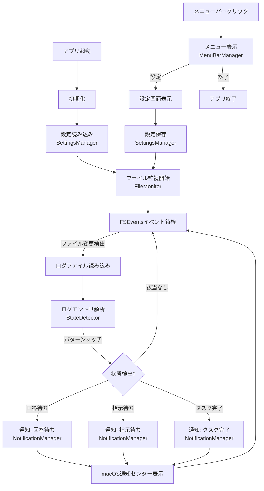
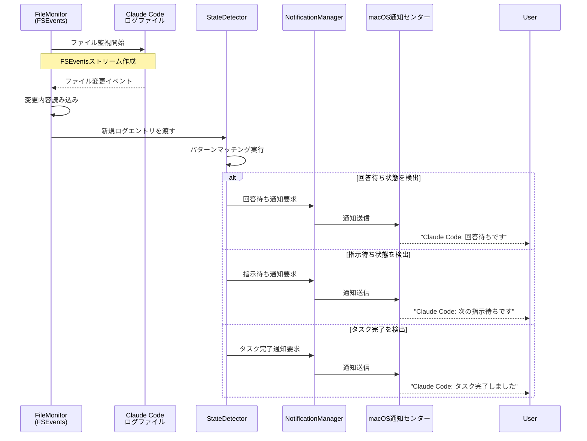
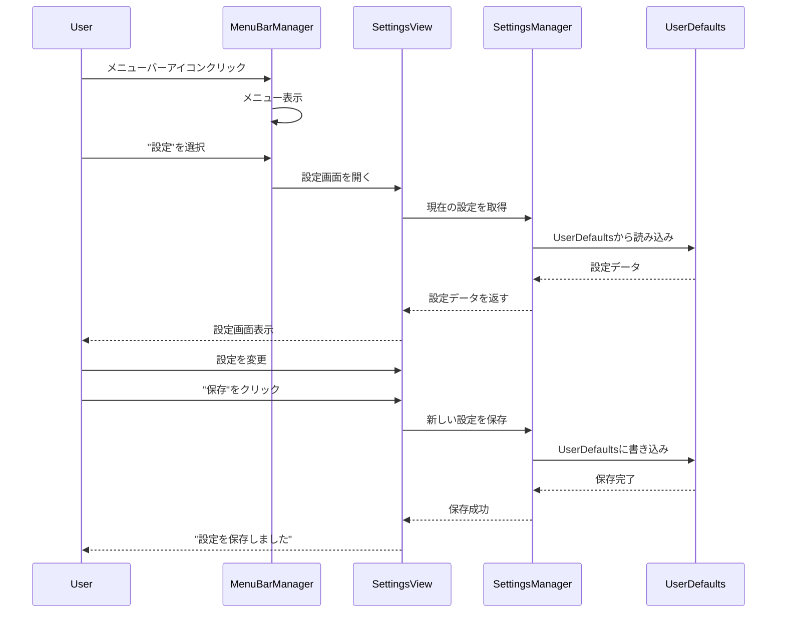
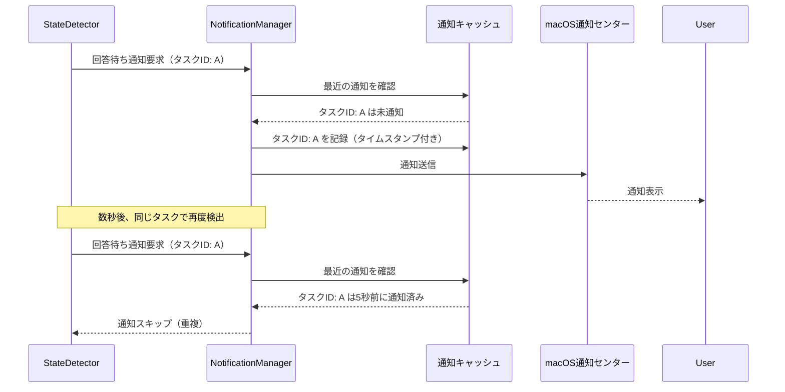
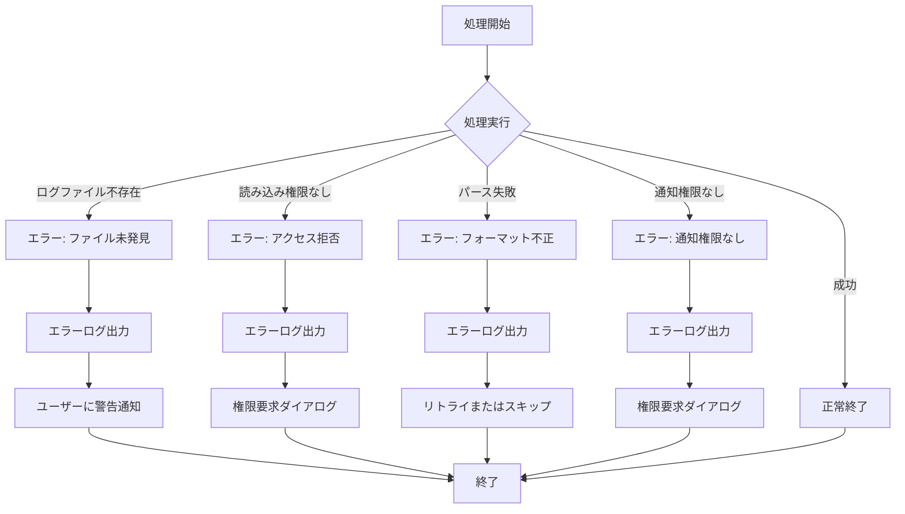
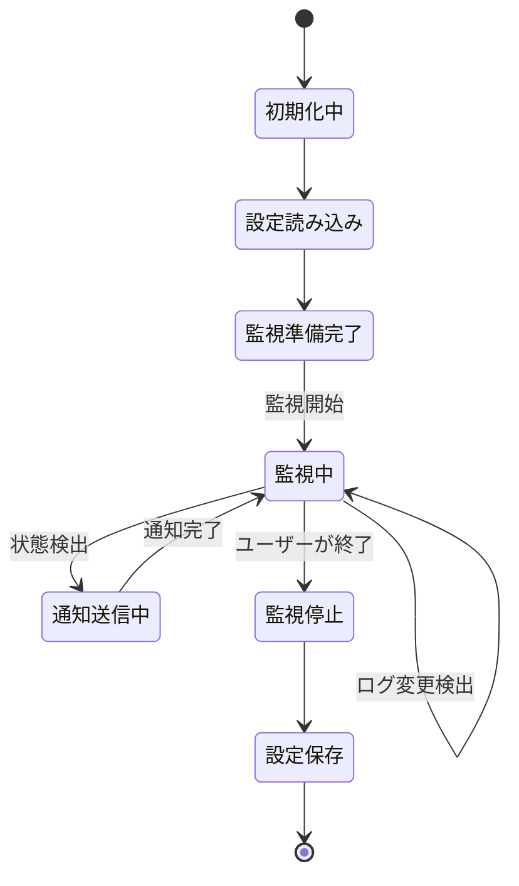
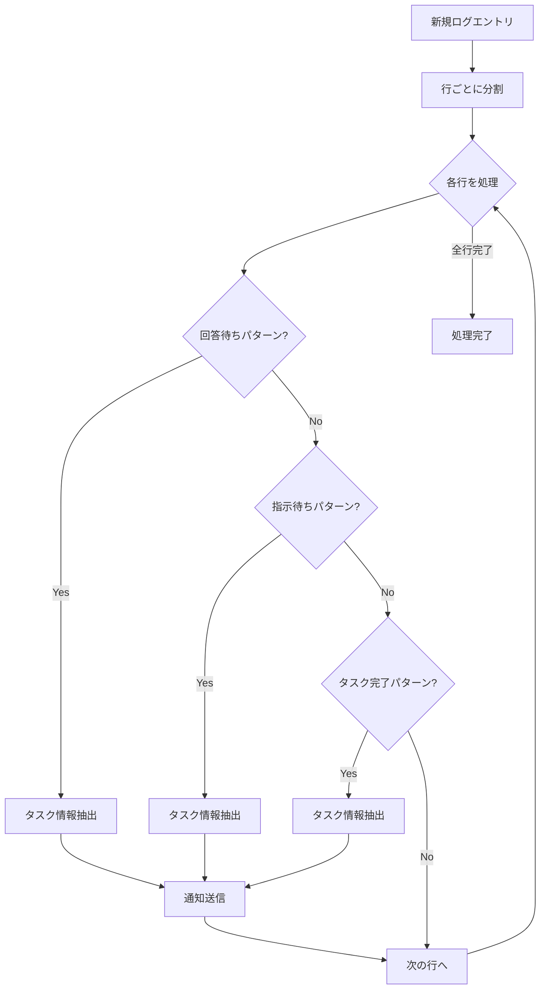

# claude-code-notifier データフロー図

**作成日**: 2026-03-26
**関連アーキテクチャ**: [architecture.md](architecture.md)
**関連要件定義**: [requirements.md](../../spec/claude-code-notifier/requirements.md)

**【信頼性レベル凡例】**:
- 🔵 **青信号**: EARS要件定義書・設計文書・ユーザヒアリングを参考にした確実なフロー
- 🟡 **黄信号**: EARS要件定義書・設計文書・ユーザヒアリングから妥当な推測によるフロー
- 🔴 **赤信号**: EARS要件定義書・設計文書・ユーザヒアリングにない推測によるフロー

---

## システム全体のデータフロー 🔵

**信頼性**: 🔵 *要件定義・アーキテクチャ設計より*



## 主要機能のデータフロー

### 機能1: ログファイル監視とイベント検出 🔵

**信頼性**: 🔵 *REQ-001, REQ-002, REQ-003, REQ-004・アーキテクチャ設計より*

**関連要件**: REQ-001, REQ-002, REQ-003, REQ-004



**詳細ステップ**:
1. **FileMonitor**: FSEvents APIでログファイルのディレクトリを監視
2. **変更検出**: ファイルに変更があった場合、イベントが発火
3. **ログ読み込み**: 前回読み込み位置から新規エントリのみ読み込み
4. **StateDetector**: ログエントリを正規表現でパターンマッチング
5. **状態判定**: 回答待ち、指示待ち、タスク完了のいずれかを判定
6. **通知送信**: NotificationManagerが適切な通知を作成・送信
7. **ユーザー通知**: macOS通知センターに通知が表示される

### 機能2: 設定管理と永続化 🔵

**信頼性**: 🔵 *設計ヒアリング Q3・アーキテクチャ設計より*

**関連コンポーネント**: SettingsManager, UserDefaults



### 機能3: 通知の重複抑制 🟡

**信頼性**: 🟡 *UX向上のため推測*

**関連コンポーネント**: NotificationManager



**備考**: この機能により、同一タスクの連続通知を防ぎ、ユーザーの邪魔にならないようにします。通知の有効期限は5分程度が妥当と推測。

## データ処理パターン

### 同期処理 🔵

**信頼性**: 🔵 *アーキテクチャ設計より*

以下の処理は同期的に実行されます：
- 設定の読み込み・保存（SettingsManager）
- パターンマッチング（StateDetector）
- メニュー表示（MenuBarManager）

### 非同期処理 🔵

**信頼性**: 🔵 *パフォーマンス要件・アーキテクチャ設計より*

以下の処理は非同期的に実行され、メインスレッドをブロックしません：
- ログファイルの読み込み（FileMonitor）
- FSEventsのイベント処理
- 通知の送信（NotificationManager）

```swift
// 非同期処理の例
DispatchQueue.global(qos: .utility).async {
    // ログファイル読み込み
    let logContent = readLogFile()
    DispatchQueue.main.async {
        // メインスレッドでUI更新
        updateUI(logContent)
    }
}
```

## エラーハンドリングフロー 🟡

**信頼性**: 🟡 *一般的なエラー処理パターンから推測*



### エラーの種類と対応

| エラー種別 | 原因 | 対応 |
|-----------|------|------|
| ログファイル未発見 | ファイルパスが不正 | ユーザーに警告、設定画面を開く |
| アクセス拒否 | ファイル読み込み権限なし | 権限要求ダイアログを表示 |
| フォーマット不正 | ログ形式が予期しない | エラーログを記録、該当エントリをスキップ |
| 通知権限なし | 通知権限が未許可 | 権限要求ダイアログを表示 |

## 状態管理フロー

### アプリケーション状態 🔵

**信頼性**: 🔵 *アーキテクチャ設計より*



### 通知状態 🟡

**信頼性**: 🟡 *UX向上のため推測*

各タスクの通知状態を管理し、重複通知を防ぎます。

```swift
// 通知状態の管理例
struct NotificationState {
    let taskId: String
    let state: ClaudeCodeState // 回答待ち/指示待ち/完了
    let timestamp: Date
}

class NotificationCache {
    private var recentNotifications: [NotificationState] = []

    func shouldNotify(taskId: String, state: ClaudeCodeState) -> Bool {
        // 5分以内に同じタスク・状態の通知があればスキップ
        let fiveMinutesAgo = Date().addingTimeInterval(-300)
        return !recentNotifications.contains {
            $0.taskId == taskId &&
            $0.state == state &&
            $0.timestamp > fiveMinutesAgo
        }
    }
}
```

## ログパース処理フロー 🟡

**信頼性**: 🟡 *REQ-001から妥当な推測*

**備考**: 実際のログフォーマットは調査が必要（prep.mdのタスク）



**想定パターン例**:
```swift
// パターンマッチングの例（実際のパターンは調査が必要）
let patterns = [
    "回答待ち": #"waiting for user input"#,
    "指示待ち": #"task completed, awaiting next instruction"#,
    "タスク完了": #"task finished successfully"#
]
```

## 関連文書

- **アーキテクチャ**: [architecture.md](architecture.md)
- **要件定義**: [requirements.md](../../spec/claude-code-notifier/requirements.md)
- **準備タスク**: [prep.md](../../spec/claude-code-notifier/prep.md)

## 信頼性レベルサマリー

- 🔵 青信号: 12件 (75%)
- 🟡 黄信号: 4件 (25%)
- 🔴 赤信号: 0件 (0%)

**品質評価**: ✅ **高品質** - 主要なデータフローは要件定義から確実に設計、推測は非本質的なUX改善のみ
